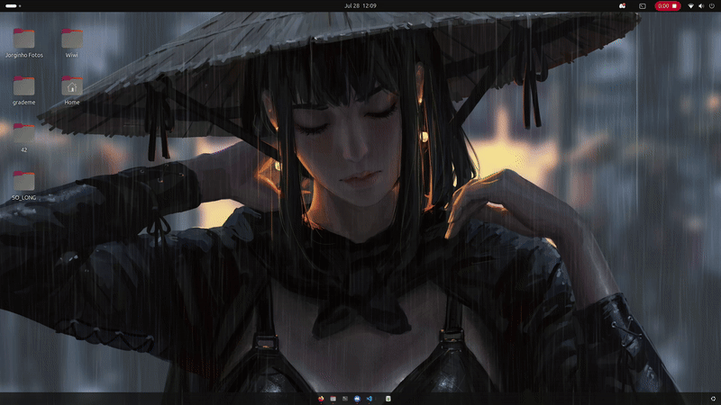

# so_long



## About

so_long is a simple 2D game project developed using the MiniLibX library. The player navigates through a map, collects items, and reaches the exit to win.

## Requirements

- Linux system
- X11 libraries installed (`libxext-dev`, `libx11-dev`, `libmlx-dev` or similar)
- MiniLibX library extracted into the `minilibx-linux` folder (must be extracted manually)

## How to use

1. Extract the MiniLibX library tarball to `minilibx-linux` folder:
   ```bash
   tar -xzf minilibx-linux.tgz
´´

2. Build the project:
   ```bash
   tar -xzf minilibx-linux.tgz
´´

3. Run the game with a valid map file:
   ```bash
   ./so_long maps/chose_your_map.ber
´´

Controls

.  W: Move Up
.  A: Move Left
.  S: Move Down
.  D: Move Right

.  ESC: Quit game


Rules

.    Collect all collectibles (C) on the map before reaching the exit (E).

.    You cannot move through walls (1).

.    The player (P) position is updated as you move.

.    Closing the window or pressing ESC exits the game safely.


Map Format

.    The map file must be rectangular.

.    Walls ('1') must surround the map.

.    There must be at least one player start position ('P'), at least one collectible ('C'), and exactly one exit ('E').


Notes

.    Make sure the MiniLibX library is extracted in the minilibx-linux folder before compiling.
.    If you experience issues running the game, verify your X11 libraries and MiniLibX installation.

Made by Jorginho at 42 Lisboa — Study project for learning C and game programming.
 
